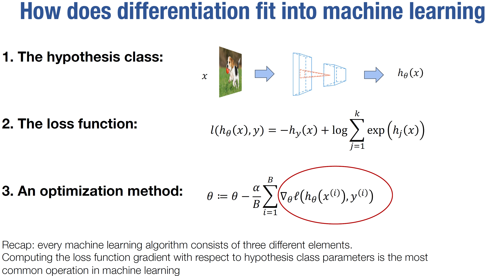
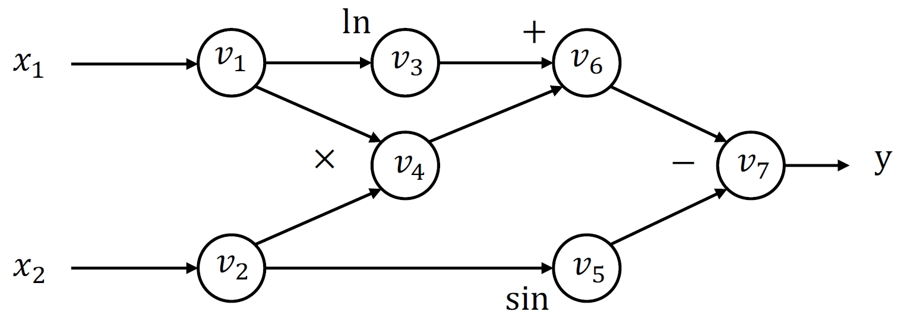

# 自动微分 （Automatic differentiation）

深度学习训练参数时，使用主流优化器，如SGD、Adam等，均依赖梯度计算，如图1中所使用的小批量随机梯度下降算法（Mini-Batch Gradient Descent）。因此，训练过程中，<span style="color:red">使计算机快速、准确、通用地进行微分计算是构建深度学习系统的一个关键技术</span>

<p align="center">
  
</p>
<p align="center"><b>图 1：</b> Mini-Batch Gradient Descent算法更新参数</p>

## 一、计算机系统实现微分的方式
### 1. 数值微分（Numerical differentiation）
#### (1) 基本实现原理
该方法是根据微分/偏微分的基本定义，使用有限差分作近似计算。对于 $f(\vec{ \theta }):R^n \rightarrow R$，梯度 $\nabla f=(\frac{\partial f}{\partial \theta_1}, \frac{\partial f}{\partial \theta_2}, ..., \frac{\partial f}{\partial \theta_n})$。
其中， $\frac{\partial f(\vec{ \theta })}{\partial \theta_i}$ 偏微分定义为：

$$
    \frac{\partial f(\vec{ \theta })}{\partial \theta_i}=\lim_{\epsilon \to 0} \frac{f(\vec{ \theta }+\epsilon e_i)-f(\vec{ \theta })}{\epsilon}   \quad     \epsilon>0
$$

如果， $n=1$，即 $\theta$ 是个标量，那么采用微分公式，即：

$$
\frac{d f(\theta)}{d \theta}=\lim_{\epsilon \to 0} \frac{f(\theta+\epsilon e_i)-f(\theta)}{\epsilon}   \quad     \epsilon>0
$$

#### (2) 代码实现
那么，根据上述公式，可设计求梯度的函数为：
```
    def gradient(f, theta):
        epsilon = 0.0001
        return (f(theta + epsilon)-f(theta)) / epsilon
```

#### (3) 优缺点
按照数值微分的方式实现求梯度具有实现简单、通用的优点，但是具有<span style="color:red">三个明显不适合计算机计算的缺点</span>
+ 计算结果不精确
+ 计算复杂度随着函数 $f$ 变化
+ 计算结果对 $\epsilon$ 的取值要求高

#### (4) 改进方法
使用高阶中心差分法，以二阶为例：

$$
    \frac{\partial f(\vec{ \theta })}{\partial \theta_i}=\frac{f(\vec{ \theta }+\epsilon e_i)-f(\vec{ \theta }-\epsilon e_i)}{2\epsilon} + O(\epsilon^2)   \quad     \epsilon>0
$$

#### (5) 实际用途
数值微分存在的缺点使其难以真正作为梯度计算方法用于训练场景。但是，这并不意味着该方法完全没用。事实上，在深度学习系统中，数值微分通常作为单元测试，去验证自动微分的正确性。

$$
    \delta^T \nabla_{\theta} f(\vec{ \theta })=\frac{f(\vec{ \theta }+\epsilon \delta)-f(\vec{ \theta }-\epsilon \delta)}{2\epsilon} + O(\epsilon^2)   \quad     \epsilon>0
$$

从unitball中取 $\delta$ 来验证自动微分的计算


## 2. 符号微分（Symbolic differentiation）

### (1) 基本原理
利用求导法则直接求出函数导数形式的表达式，
例如，函数加法求导：

$$
    \frac{\partial (f(\theta)+g(\theta))}{\partial \theta} = \frac{\partial f(\theta)}{\partial \theta} + \frac{\partial g(\theta)}{\partial \theta}
$$

例如，函数嵌套求导：

$$
    \frac{\partial f(g(\theta))}{\partial \theta} = \frac{\partial f(g(\theta))}{\partial g(\theta)} \cdot \frac{\partial g(\theta)}{\partial \theta}
$$

### (2) 代码实现
以 $n$ 个数的连成为例：

$$
    f(\theta) = \prod \limits_{i=0}^n \theta_i
$$

根据求导法则，可得：

$$
    \frac{\partial f(\theta)}{\partial \theta_k} = \prod \limits_{j \neq k}^n \theta_j
$$

可得函数实现：

```
    def gradient(f, theta):
        grad_array = []
        for i in range(0, n+1):
            grad_i = 1
            for j in range(0, n+1):
                if i != j:
                    grad_i = grad_i * theta[j]
            grad_array.append(grad_i)
```

### (3) 优缺点
由于是按求导法则算出，符号微分具有计算结果精确的优点，但是存在下面三个严重的缺点，使其难以应用到计算机求导中：
+ 每一个算法都必须准备一个导数表达式，并进行代码实现，非常不利于通用性和扩展。
+ 算式复杂将导致导数表达式变得十分复杂。
+ 求偏微分时，计算复杂度与向量维度正相关，当维度很大时，求解非常耗时。

## 3. 自动微分（Automatic differentiation）
### (1) 基本原理
任意复杂计算均是由有限的基本运算组成，利用导数的链式法则，把基本运算导数的符号微分求出，然后组合成复杂计算的导数。

导数的链式法则：

$$
\frac{\partial y}{\partial x} = \frac{\partial y}{\partial u_n} \cdot \frac{\partial u_n}{\partial u_{n-1}} \cdot ... \cdot \frac{\partial u_2}{\partial u_{1}} \cdot \frac{u_1}{x}
$$

按照乘法的结合律，链式法则的计算过程可以按正向过程计算，也可以按反向过程计算。正向计算如下：

$$
\frac{\partial y}{\partial x} = (\frac{\partial y}{\partial u_n} \cdot (\frac{\partial u_n}{\partial u_{n-1}} (\cdot ... \cdot (\frac{\partial u_2}{\partial u_{1}} \cdot \frac{u_1}{x}))))
$$

正向计算过程是从输入端开始计算求导，反向过程则是从输出端开始计算求导，反向计算如下：

$$
\frac{\partial y}{\partial x} = (((\frac{\partial y}{\partial u_n} \cdot \frac{\partial u_n}{\partial u_{n-1}})\cdot ...) \cdot \frac{\partial u_2}{\partial u_{1}}) \cdot \frac{u_1}{x}
$$

### (2) 优缺点
自动微分具有精确、可扩展性和通用性强。实现时只需实现基本运算的符号微分，利用链式法则在进行计算时自动组装，实现非常简单。因此，非常适合用于深度学习训练。

必须注意的是<span style="color:red">两个方向的微分存在不同的适应场景</span>，对于 $f: R^n\rightarrow R^k$，此时采用正向自动微分的整体正向传递次数为 $n$ 次（求 $n$ 次偏导），采用反向自动微分则只需要整体传递 $k$ 次。当 $n>k$ 时，即输入维度大于输出维度，反向微分的整体计算次数会更少，反正则更适合正向微分。因此，对于深度学习训练，通常输入维度高于输出维度，更适合反向自动微分。

# 二、深度学习系统中自动微分的实现

## 1. 计算图
为了更方便将复杂计算分解成基本运算操作子，可以将任意计算表示成一个有向无环图（Directed Acyclic Graph, DAG）。其中顶点为计算时的操作和数值，边为数据流或依赖关系。例如：

$$
    y=f(x_1, x_2)=\ln(x_1) + x_1 \cdot x_2 - \sin x_2
$$

该计算式可被转换成计算图：

<p align="center">
  
</p>
<p align="center"><b>图 2：</b> 计算图示例</p>

注意，在深度学习训练系统设计过程中，并不需要真的建立一个DAG。而是通过建立网络关系式时，把DAG的连接关系保存在Tensor（一种通用的数据表示结构，是深度学习中最基础的数据单元，也是计算图中的顶点）中。


## 2. 自动微分示例
假设图中 $x_1=2$, $x_2=5$，进行前向自动微分和反向自动微分定义

### (1) 前向自动微分
定义 $\dot{v_i} = \frac{\partial v_i}{\partial x_1}$，可根据计算图推导前向自动微分

|   步骤   |   计算变量   |   前向自动微分   |
|:------:|:------:|:------:|
|  输入   |  $v_1 = x_1 = 2$   |  $\dot{v_1} = 1$   |
|  输入   |  $v_2=x_2=5$   |  $\dot{v_2} = 0$   |
|  1   |  $v_3=\ln v_1 = \ln 2 = 0.693$   |  $\dot{v_3} = \frac{\dot{v1}}{v1} = 0.5$   |
|  2   |  $v_4 = v1 \times v2 = 10$   |  $\dot{v_4}=\dot{v1}\cdot v_2 + v1 \cdot \dot{v_2} = 5$   |
|  3   |  $v_5 = \sin{v_2} = -0.959$   |  $\dot{v_5}=\cos{v_2}\cdot \dot{v_2} = 0$   |
|  4   |  $v_6 = v_3 + v_4 = 10.693$  |  $\dot{v_6} = \dot{v_3} + \dot{v_4} = 5.5$   |
|  5   |  $v_7 = v_6 - v_5 = 11.652$  |  $\dot{v_7} = \dot{v_6} + \dot{v_5} = 5.5$   |
|  输出   |  $y = v_7 = 11.652$   |  $\frac{\partial y}{x_1} = \dot{v_7} = 5.5$   |

想要求 $\frac{\partial v_i}{\partial x_2}$ ,还必须再走一次传播流程。

### (2) 反向自动微分
定义 $v_i$ 的伴随值（ $y$ 对 $v_i$ 的偏导）为 $ \bar v_i = \frac{\partial y}{\partial v_i} $，根据计算图推导反向自动微分过程

|   步骤   | 用到的计算式 |   反向自动微分   |
|:------:|:------:|:------:|
|  1   | $y = v_7$ | $\bar v_7 = \frac{\partial y}{\partial v_7} = 1$   |
|  2   | $v_7 = v_6 - v_5$ | $\bar v_6 = \bar v_7 \cdot \frac{\partial v_7}{\partial v_6} = 1 \cdot 1 = 1$   |
|  3   | $v_7 = v_6 - v_5$ | $\bar v_5 = \bar v_7 \cdot \frac{\partial v_7}{\partial v_5} = 1 \cdot (-1) = -1$   |
|  4   | $v_6 = v_3 + v_4$ | $\bar v_4 = \bar v_6 \cdot \frac{\partial v_6}{\partial v_4} = 1 \cdot 1 = 1$   |
|  5   |  $v_6 = v_3 + v_4$ | $\bar v_3 = \bar v_6 \cdot \frac{\partial v_6}{\partial v_3} = 1 \cdot 1 = 1$ |
|  输出   |  $v_5 = \sin v_2$ <br> $v_4 = v_1 \cdot v_2$ | $\frac{\partial y}{\partial x_2} = \bar v_2 = \bar v_4 \cdot \frac{\partial v_4}{\partial v_2} + \bar v_5 \cdot \frac{\partial v_5}{\partial v_2} = 1 \cdot v_1 + (-1) \cdot \cos v_2 = 1.716$  |
|  输出   |  $v_4 = v_1 \cdot v_2$ <br> $v_3 = \ln v_1$  | $\frac{\partial y}{\partial x_1} = \bar v_1 = \bar v_3 \cdot \frac{\partial v_3}{\partial v_1} + \bar v_4 \cdot \frac{\partial v_4}{\partial v_1} = 1\cdot \frac{1}{v_1} + 1 \cdot v_2 = 5.5$ |

由于函数 $y = f(x_1, x_2)$ 是两个输入、一个输出，通过反向自动微分只需要一次完整的反向传递就能计算出对两个输出的偏微分。

## 3. 反向自动微分算法


```
    def gradient(out):
        # 存储每个每个节点的伴随值列表
        node_to_grad = {out: [1]}

        # 从反向拓扑需中取节点并计算输出对它的微分
        for i in reverse_topo_order(out):
            # 计算第i个节点的伴随值
            adjoint[i] = sum(node_to_grad[i])
            
            for j in inputs[i]:
                # 求出第i个节点的每一个输入节点对它的伴随值
                adjoint_j_i = adjoint[i] * partial(i, k);
                # 这个伴随值会被用于计算j的伴随值
                node_to_grad[j].append(adjoint_j_i)
        
        return adjoint[in]
```
