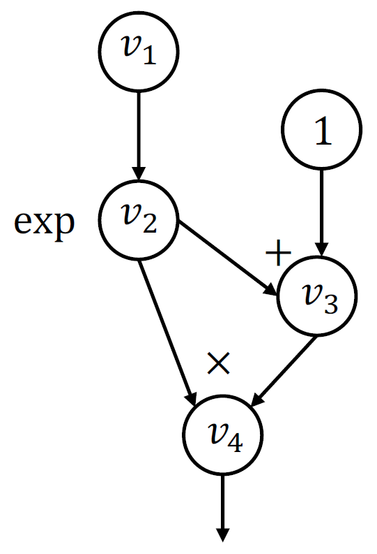

# 深度学习系统的编程抽象

## 一、前言

编程抽象能从高层定义训练系统的实现、扩展和模型执行计算的通用方法。本篇章首先对已有深度学习系统（或框架）的抽象进行思考，以便：
+ 理解这些框架为何要采用这些抽象设计
+ 学习过往经验以用于新的抽象设计

然后根据深度学习的三要素，建立各关键模组的抽象。

## 二、深度学习训练系统的抽象发展过程

### 1. 基于分层接口设计的第一代深度学习框架

#### 1）基本思想
网络模型是通过一系列的 **Layer** (层)顺序连接构成，因此，最自然的设计就是以层作为基本抽象，不同的层来实现不同的功能单元，如卷积、ReLU、Pooling、InnerProduct（全连接）、Softmax 等。利用层的组合就能构建出整个网络前向和反向传播的计算图。

层的标准接口（C++）：

```
class Layer {
public:
    virtual void Forward(const vector<Blob*>& bottom, const vector<Blob*>& top);
    virtual void Backward(const vector<Blob*>& top, const vector<bool>& propagate_down, const vector<Blob*>& bottom);

private:
    ...
};
```

层的标准接口（python）：

```
class Layer:
    def forward(bottom, top):
        pass
    def backward(top, propagate_down, bottom):
        pass
```

Caffe 1.0、Torch7、cuda-convnet 等均是基于层抽象的深度学习框架。

#### 2）层的抽象设计动机

① 面向对象设计
+ 层在神经网络描述中是天然适配面向对象的设计范式。
+ 具体的层可以继承自Layer这个基类，然后实现各自对应的Forward/Backward接口，符合经典的多态与模块化设计。

② 模块复用和可扩展设计
+ 用户只需要关心具体网络层的设计，底层训练方式可通用无需修改。
+ 典型的 “封装 + 继承 + 多态” 设计。

③ 前向/反向清晰分离，便于求导维护

#### 3）基于层抽象的神经网络示例

```
import numpy as np

# 基类：每一层都有 forward 和 backward 接口
class Layer:
    def forward(self, input):
        raise NotImplementedError
    def backward(self, grad_output):
        raise NotImplementedError

# 全连接层
class Linear(Layer):
    def __init__(self, in_features, out_features):
        self.W = np.random.randn(in_features, out_features) * 0.01
        self.b = np.zeros(out_features)
    
    def forward(self, input):
        self.input = input  # 保存输入供反向传播使用
        return input @ self.W + self.b
    
    def backward(self, grad_output):
        # 梯度计算
        self.grad_W = self.input.T @ grad_output
        self.grad_b = np.sum(grad_output, axis=0)
        return grad_output @ self.W.T

# ReLU 层
class ReLU(Layer):
    def forward(self, input):
        self.mask = input > 0
        return input * self.mask
    
    def backward(self, grad_output):
        return grad_output * self.mask

# 均方误差损失层
class MSELoss:
    def forward(self, prediction, target):
        self.pred = prediction
        self.target = target
        return np.mean((prediction - target) ** 2)

    def backward(self):
        return 2 * (self.pred - self.target) / self.target.size

# 构造网络结构：Linear -> ReLU -> Linear
layers = [
    Linear(3, 4),  # 输入 3 → 隐藏层 4
    ReLU(),
    Linear(4, 2)   # 隐藏层 4 → 输出 2
]
loss_fn = MSELoss()

# 模拟一个批次的数据（batch_size=5）
X = np.random.randn(5, 3)
y = np.random.randn(5, 2)

# 简单训练循环
lr = 0.1
for epoch in range(100):
    # Forward pass
    out = X
    for layer in layers:
        out = layer.forward(out)
    loss = loss_fn.forward(out, y)

    # Backward pass
    grad = loss_fn.backward()
    for layer in reversed(layers):
        grad = layer.backward(grad)

    # 更新参数
    for layer in layers:
        if isinstance(layer, Linear):
            layer.W -= lr * layer.grad_W
            layer.b -= lr * layer.grad_b

    if epoch % 10 == 0:
        print(f"Epoch {epoch}, Loss = {loss:.4f}")

```

+ 每一层独立封装自己的 forward/backward 逻辑
+ 网络是层的组合，执行上是顺序的 forward/backward 调用
+ 参数更新在每层内部实现，但由外部训练循环统一驱动

#### 4）优点
+ 模块化强：每层是一个独立的组件，便于组合、调试和复用
+ 清晰的逻辑结构：前向和反向函数明确分离，流程透明
+ 易于扩展：用户可以通过继承写自定义 Layer 插件
+ 性能可控：手写反向传播可以避免 Autograd 带来的冗余计算
+ 结构直观：网络结构基本和代码结构一致，符合直觉


#### 5）缺点
+ 灵活性有限：不能动态控制图结构（如RNN变长序列、条件分支）
+ 开发门槛高：自定义层需手写正反向代码，接口繁琐
+ 计算图构建与执行耦合：静态图，难以适应动态图建模需求
+ 功能粒度较粗：无法将更细粒度的运算表达成层（如逐元素操作）
+ 和张量操作割裂：难以与 NumPy 风格的逐元素计算表达配合

总之，基于层的抽象设计还是难以灵活、细粒度控制网络内部的计算，尽管扩展容易，但是带来的成本过高，自定义网络计算方式时需要手写Layer插件。因此，需要更细粒度的抽象，才能使用户更方便、更灵活组合和定义网络模型

### 2. 基于静态图设计的第二代深度学习框架

#### 1）基本设计思想
为了更加灵活、细粒度的对网络内部计算进行抽象，将原本的层抽象拆分成“张量-算子-计算图”的抽象形式。其中，张量构成计算图的边，算子作为计算图的节点，算子每一个网络层，均可由计算图自由组成。整个神经网络就由一个大的计算图来描述。

第二代深度学习框架采用静态计算图（Define-Then-Run）设计，即用户需要先定义整个网络的计算图，构建完整的计算计划，然后再通过Session.run()来决定执行计算图的哪个部分，最后再通过自动求导完成反向图的计算以实现训练。

典型的基于静态图的深度学习框架有TensorFlow 1.x, CNTK, MXNet等。

#### 2）基于静态图的深度学习框架的使用示例

图1展示了一个简单的计算图，下面使用TensorFlow 1.x对其描述的网络进行构建
<p align="center">
  
</p>
<p align="center"><b>图 1：</b> 一个简单的计算图示例</p>

```
import tensorflow as tf
v1 = tf.Variable()
v2 = tf.exp(v1)
v3 = v2 + 1
v4 = v2 * v3
sess = tf.Session()
value4 = sess.run(v4, feed_dict={v1: numpy.array([1])})
```

上述计算图也可以只表示部分子图，例如到 $v_3$ :

```
value3 = sess.run(v3, feed_dict={v1: numpy.array([1])})
```

#### 3）优点
+ 图是全局的、静态的，利于全局优化（如常量折叠、内存分配优化、编译为 XLA）。
+ 易于跨平台部署（如转为 .pb 文件）

#### 4）缺点
+ 构建模式类似编译型语言，必须完全建完图才能执行，不符合python的执行方式
+ 不利于调试：图构建与执行分离，出错信息少
+ 不适合动态模型和大模型（如 Transformer with varying length）

### 3. 基于动态图的第三代深度学习框架

#### 1）基本设计思想
为了便于动态模型和大模型的训练，希望计算图在前向执行过程中即时构建，这样可以方便更精细的控制流，并在中途对网络进行调试和改写。因此，第三代深度学习框架采用动态图（Define-by-Run）来定义网络模型，并配合Autograd，记录每个操作构成的动态图，用于反向传播。

典型的基于动态图的深度学习框架有PyTorch, TensorFlow 2.x（Eager）, JAX等

#### 2）示例
依然以图1为例，采用PyTorch对其计算图描述的网络进行构建
```
import torch

v1 = torch.Tensor([1])
v2 = torch.exp(v1)
v3 = v2 + 1
v4 = v2 * v3
```

由于是动态图，在每行代码执行过程中即完成了图的构建，因此，每行代码执行完就可以立即获得结果。更重要的是，可给模型加入更精细化控制的条件分支：

```
if v4.numpy() > 0.5:
    v5 = v4 * 2
else:
    v5 = v4
v5.backward()
```

#### 3）优点
| 优点               | 解释                                                                        |
| ---------------- | ------------------------------------------------------------------------- |
| **1. 灵活性极高**     | 计算图是运行时构建，天然支持复杂条件分支、循环、递归，写法与 Python 原生一致，适合 Transformer、RNN、条件生成模型等动态结构 |
| **2. 即写即跑，直观易用** | 没有“先定义图后执行”，更符合 Python 的命令式思维，像普通 NumPy 代码一样                              |
| **3. 调试友好**      | 可以逐行打印、用 Python 原生调试器单步调试，出错信息直接指向源代码，易定位                                 |
| **4. 自然的控制流支持**  | 不需要额外的控制流原语（如 `tf.cond` / `tf.while_loop`），直接用 Python `if` / `for`        |
| **5. 易于原型开发与实验** | 研究者快速迭代模型、验证新想法，无需考虑静态图的编译限制                                              |

#### 4）缺点
| 缺点                  | 解释                                                                      |
| ------------------- | ----------------------------------------------------------------------- |
| **1. 不利于全局图优化**     | 每次前向执行都会生成不同的图，难以对整个模型做静态分析（如操作融合、内存复用、跨层算子合并），导致潜在执行效率比静态图低            |
| **2. 部署/推理效率相对较低**  | 由于图是临时构建的，很难像静态图一样导出为高度优化的中间表示，且在移动端/嵌入式部署时开销较大                         |
| **3. 运行时开销更大**      | 需要在执行时动态记录操作和依赖关系，有额外的元数据和调度开销                                          |
| **4. 跨平台/后端编译支持复杂** | 如果要针对特定硬件（如 TPU、FPGA）做 Ahead-of-Time 编译，需要额外的 tracing/JIT 机制来将动态图捕获成静态图 |
| **5. 需要额外机制保证一致性**  | 同一个模型不同输入下的控制流可能不同，静态优化器或保存导出的推理模型时，需要保证所有路径一致性，增加了复杂度                  |


### 4. 小结
对比深度学习框架的对神经网络抽象方式的发展不难发现，“张量 + 算子（operator） + 计算图” 其实就是后续框架对“层”抽象的进一步通用化和细粒度化。

**层被分解为更细粒度的“张量 + 算子”**，层与层之间的关系则通过“计算图”来实现表达。

不同的神经网络层 ≈ 模块化的子图（Module = Subgraph），**一段由张量和算子组成的可重用子图**。

| 特性   | 层（Layer）   | 张量+算子+计算图   |
| ---- | ---------- | ----------- |
| 抽象层级 | 粗粒度，像积木块   | 细粒度，可任意组合   |
| 扩展性  | 新层要手写前向/后向 | 新算子可组合或自动求导 |
| 灵活性  | 适合固定结构     | 适合复杂动态结构    |
| 自动求导 | 通常不自动      | 基于算子自动构建反向图 |

采用更细粒度的抽象，能够：
+ 更灵活表达
    * 不需要每个新操作都写一个 Layer 类。
    * 动态控制流下可以即时拼接算子，构成任意复杂子图。

+ 自动求导，实现更大规模的网络模型
    * 对算子自动注册梯度规则，不再要求层手动实现反向。
    * 节省重复代码，降低出错率。

+ 图级优化可能性
    * 可以对算子做内联、融合、内存优化（如 XLA、TorchInductor）。
    * 张量运算组合可以映射到多种硬件（CPU/GPU/TPU）。

总之，现代框架的抽象：
层 = 张量 + 一组算子 + 参数封装 + 前向函数
网络 = 层（或算子）在计算图中的组合

要设计自己的训练框架，推荐从“张量 + 算子 + 计算图”开始，层只作上层封装抽象（如模块），这样既灵活又可维护。